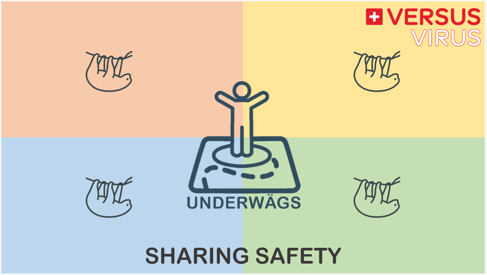
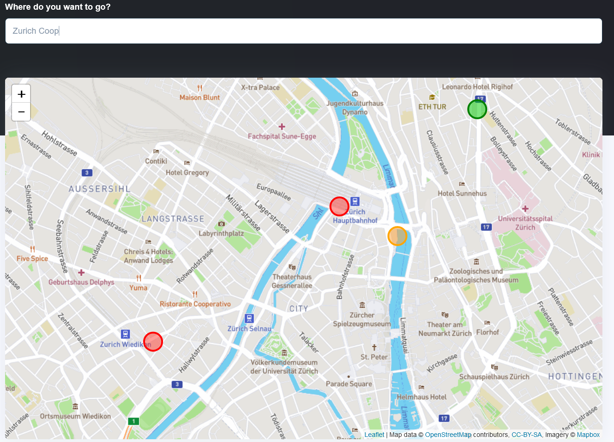

# Underwägs

This is the Repo for Team 88 of the Hackathon VersusVirus 2020

The goal of this project is create an App to help people making good decisions about how to move in public spaces and help establishing a safe use of public spaces.

